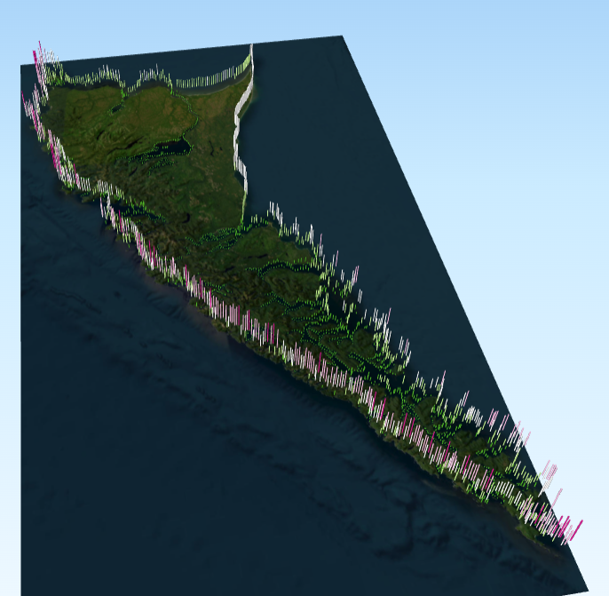

# Onlinemaps

This is a repository of Haida Gwaii environmental maps, at the coastal level, sampled at 1 km along the coastline. 
The colors and heights are normalized to the maximum value, so they do not represent actual values, just the distribution of higher and lower values. 
This exercise was developed in QGIS using the [QGis2threejs](https://plugins.qgis.org/plugins/Qgis2threejs/) plugin. 

 
  

You can view the interactive maps here:
[Fetch](https://biogeoscienceslaboxford.github.io/Onlinemaps/HG_Fetch.html)

[Wind Speed](https://biogeoscienceslaboxford.github.io/Onlinemaps/HG_WindSpeed.html)

[Tidal Amplitude](https://biogeoscienceslaboxford.github.io/Onlinemaps/HG_TidalAmp.html)

[Total suspended matter Spring](https://biogeoscienceslaboxford.github.io/Onlinemaps/HG_TSM_Spring.html)

[Total suspended matter Summer](https://biogeoscienceslaboxford.github.io/Onlinemaps/HG_TSM_Summer.html)
